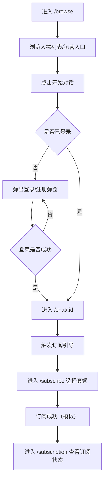
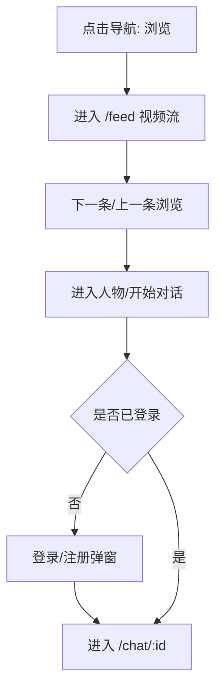

## 1. 产品概述
面向用户提供“浏览/短剧/对话”的 AI 虚拟人内容与对话入口，并支持“创建人物”与“订阅”转化。
- 目标用户：喜欢虚拟人陪伴、内容消费（虚拟直播/短剧）并有强互动诉求的用户
- 产品价值：用真实可交互原型演示核心路径（浏览发现→进入人物→开始对话→订阅）

## 2. 核心功能

### 2.1 用户角色
| 角色 | 注册/登录方式 | 核心权限 |
|------|---------------|----------|
| 游客 | 无 | 可浏览内容与人物列表；尝试开始对话时引导登录（可在原型中允许“继续作为游客”或强制登录，见流程） |
| 已登录用户 | 弹窗登录/注册（仅前端模拟） | 可进入对话页、查看会话列表、进入订阅页、进入订阅管理页 |

### 2.2 功能模块（页面级）
1. **浏览（首页默认）**：顶部工具区（订阅/语言/登录）、运营 Banner、快捷入口（虚拟直播/短剧）、人物列表
2. **浏览-刷视频流**：类似“刷抖音”的纵向视频卡片流（模拟素材/封面），可快速进入人物详情/对话
3. **短剧**：短剧列表与播放页（原型级：列表 + 详情/播放面板即可）
4. **创造人物**：创建向导（分步表单）+ 创建完成后的预览/进入对话
5. **对话**：会话列表 + 聊天窗口（可选择人物开始新对话）
6. **订阅**：套餐页（购买/订阅流程仅前端模拟）
7. **订阅管理**：当前套餐、到期时间、取消订阅（模拟）

### 2.3 页面明细
| 页面名称 | 模块名称 | 功能说明 |
|---|---|---|
| 浏览（/browse） | 左侧导航 | 固定不变；点击后仅右侧内容切换，同时 URL 改变 |
| 浏览（/browse） | 顶部工具区 | 订阅入口、语言切换（简体/繁体/英文）、登录/注册入口（弹窗） |
| 浏览（/browse） | 运营 Banner | 展示 1-3 个运营位（可轮播/可点击，跳转到指定入口：订阅/短剧/人物） |
| 浏览（/browse） | 快捷入口 | “虚拟直播”“短剧”两个入口卡片/按钮，点击跳转对应页面 |
| 浏览（/browse） | 人物列表 | 卡片流：头像、昵称、标签、简短介绍、在线/热度等；主按钮“开始对话” |
| 浏览刷视频（/feed） | 视频流 | 纵向一屏一卡；支持下一条/上一条（滚轮/按钮）；可点“进入人物/开始对话” |
| 短剧（/shorts） | 短剧列表 | 封面、标题、集数/热度；点击进入播放面板 |
| 短剧（/shorts/:id） | 播放面板 | 选集、简介、推荐；可引导订阅（如“解锁全集”） |
| 创造人物（/create） | 创建向导 | 分步：基础信息（昵称/性格标签/简介）→外观（头像选择/生成）→设定（开场白/风格）→完成 |
| 对话（/chat） | 会话列表 | 最近会话、搜索、删除/置顶（原型级可选） |
| 对话（/chat/:id） | 聊天窗口 | 人物信息区、消息列表、输入框、发送、快捷回复（原型级可选） |
| 订阅（/subscribe） | 套餐列表 | 月/年套餐、权益列表、订阅按钮；订阅成功后写入“当前订阅状态” |
| 订阅管理（/subscription） | 管理面板 | 当前套餐、到期时间、自动续费开关/取消订阅（均为前端模拟） |
| 全局 | 登录/注册弹窗 | 手机/邮箱 + 密码/验证码（二选一即可）；“登录/注册/忘记密码”切换；成功后全局展示用户态 |
| 全局 | 语言切换 | 立即切换文案（至少覆盖导航、按钮、标题、关键提示） |

## 3. 核心流程

### 3.1 主路径（发现→对话→订阅）
1. 用户打开产品进入 /browse
2. 用户在人物列表中点“开始对话”
3. 若未登录：弹出登录/注册弹窗；登录成功后进入对话页并自动打开该人物会话
4. 在对话页内看到订阅引导（例如：某些功能/更多消息次数需要订阅）
5. 进入 /subscribe 选择套餐并“订阅成功”（前端模拟）
6. 进入 /subscription 查看订阅状态与管理按钮

### 3.2 内容消费路径（刷视频→进入人物→对话）

## 4. 用户界面设计

### 4.1 设计风格
- 整体：简约、低干扰、强调信息结构清晰（左侧导航 + 右侧内容）
- 布局：固定侧边栏，右侧内容根据路由切换；顶部工具区常驻
- 组件：卡片化列表（人物/短剧/入口）、轻量 Banner、弹窗表单
- 交互：重点呈现“真实产品体验”，包括按钮状态、加载态、成功/失败提示、空状态

### 4.2 页面设计概览
| 页面名称 | 模块名称 | UI 元素 |
|---|---|---|
| /browse | 左侧导航 | 当前路由高亮、图标+文字、折叠（可选） |
| /browse | 顶部工具区 | “订阅”按钮、语言切换下拉、登录按钮/用户头像下拉 |
| /browse | Banner | 大横幅卡片、可点击、可轮播指示点 |
| /browse | 快捷入口 | 两张入口卡（虚拟直播/短剧）带简短说明 |
| /browse | 人物列表 | 多列卡片、标签、主 CTA “开始对话” |
| /feed | 视频流 | 纵向全屏卡；右侧浮动操作（进入人物/开始对话/点赞占位） |
| /chat | 会话列表 + 聊天窗 | 左会话列表、右聊天区域、输入框与发送按钮、消息气泡 |
| /subscribe | 套餐页 | 套餐卡、权益列表、订阅按钮、价格强调 |
| /subscription | 管理页 | 当前套餐信息、到期时间、取消订阅/续费开关（模拟） |

### 4.3 响应式
- 默认桌面优先（demo 给别人看优先保证桌面体验）
- 在小屏时：侧边栏可折叠为图标栏；右侧列表变为单列/双列
