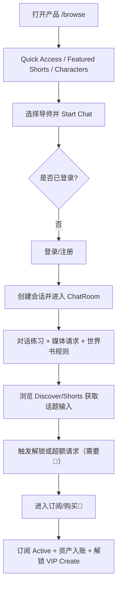
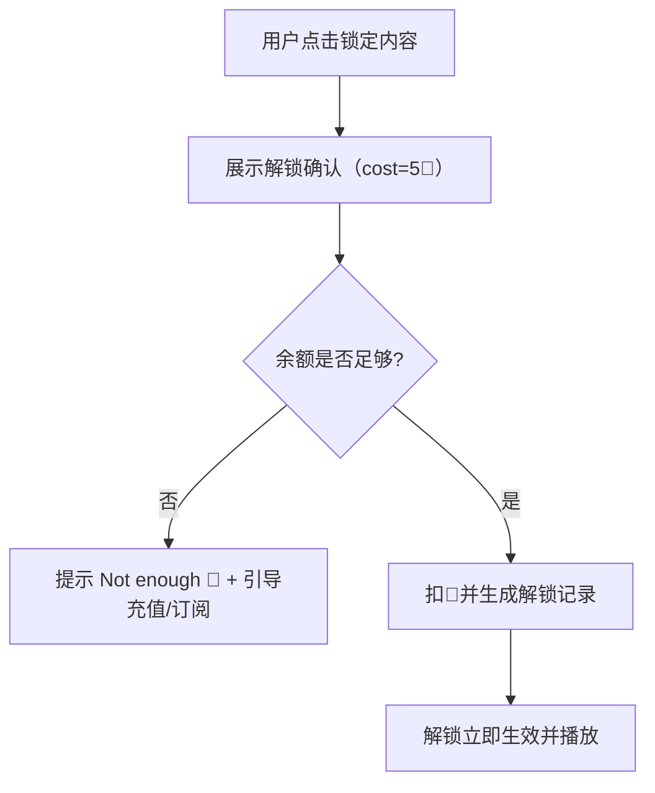
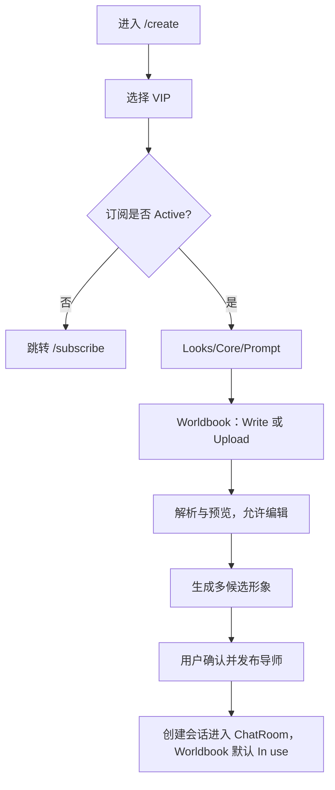

# 产品功能文档（真实产品版，AI 可读）- AI Language Coach

版本：真实产品版（用于研发落地与 AI 开发，不等同于 Demo 本地 mock 行为）  
定位：AI 外语学习教练（AI Language Coach / AI 学外语）  
目标：清晰描述“每个页面/模块的功能、字段、数据归属与来源、交互逻辑、状态机、异常与边界、模块关系”，便于研发或 AI 直接实现一致的产品行为。  
非目标：不描述接口字段、数据库表结构、技术选型、SDK、后端实现方式。

---

## 1. 产品概述

AI Language Coach 是一个以“对话练习”为核心的外语学习产品，通过 AI 导师（Tutor）陪练、纠错、角色扮演与短内容（Shorts/Discover）形成闭环；结合订阅与💎体系完成付费转化与内容解锁。

核心价值：
- 快速进入练习：打开即学、即聊、即纠错
- 可持续提升：世界书（Worldbook）定义导师教学风格与规则，形成稳定训练方法
- 内容化学习：Shorts/Discover 以碎片内容提供话题与输入，回流到 Chat 练习
- 明确商业化：订阅解锁能力 + 💎用于解锁内容与额外请求

---

## 2. 用户角色与权限模型

### 2.1 角色定义

- 游客（未登录）
- 登录用户（已登录）
- 订阅用户（Subscription Active）

### 2.2 权限与能力矩阵（产品口径）

| 能力 | 游客 | 登录用户 | 订阅用户 |
|---|---|---|---|
| 浏览首页/Discover/Shorts/Blog/政策页 | ✅ | ✅ | ✅ |
| 进入 Chat 与创建会话 | ❌（需登录） | ✅ | ✅ |
| 查看 Favorites | ❌（需登录） | ✅ | ✅ |
| Standard 创建导师 | ✅（可创建，但保存/同步需要登录；产品可要求登录后保存） | ✅ | ✅ |
| VIP 创建导师（Prompt + Worldbook 上传） | ❌ | ❌（需订阅） | ✅ |
| 购买💎包 | ❌ | ❌（需订阅） | ✅ |
| 解锁 Discover clip / Shorts 锁集 | ✅（建议允许） | ✅ | ✅ |
| 媒体请求（Request Image/Video） | ✅（建议允许，但需有💎或免费额度） | ✅ | ✅ |

说明：
- “游客是否允许消耗💎解锁”在真实产品中取决于商业策略。推荐策略：游客可浏览与试看，但解锁/购买需登录，以确保资产归属。
- Demo 中以本地持久化模拟账户资产；真实产品中资产必须归属到账号并可跨设备同步。

---

## 3. 核心数据对象（字段 + 归属/来源）

本节不涉及接口或表结构，只描述“数据由谁产生/维护、在产品中如何使用”。

### 3.1 Account（账号）

归属：账号系统  
用途：鉴权、资产归属、同步收藏/会话/解锁/订阅等。

字段：
- `accountId`
- `displayName`
- `avatarUrl`
- `email`（或第三方账号标识）
- `provider`（email/google/discord/x…）
- `createdAt`
- `status`（active/banned/deleted）

### 3.2 Subscription（订阅）

归属：订阅与计费系统（权益归属到账号）  
用途：决定 VIP 创建权限、决定是否允许购买💎包、决定产品权益（额度/解锁折扣等）。

字段：
- `planId`（month/quarter/year…）
- `status`（none/active/canceled/expired/past_due）
- `autoRenew`（true/false）
- `currentPeriodStartAt`
- `currentPeriodEndAt`（或 `expiresAt`）
- `cancelAtPeriodEnd`（取消后到期生效）
- `gracePeriodEndAt`（可选，扣费失败宽限期）

### 3.3 DiamondWallet（💎钱包）与 Ledger（流水）

归属：虚拟资产系统（账号维度）  
用途：解锁内容、媒体请求、付费道具。

字段：
- Wallet：
  - `balance`
  - `updatedAt`
- Ledger（明细，强建议可追溯）：
  - `ledgerId`
  - `type`（earn/spend/refund/adjust）
  - `amount`（正/负）
  - `currency`（固定为 💎）
  - `reason`（unlock_short_episode / unlock_feed_clip / media_request / bonus / purchase_pack…）
  - `refId`（关联对象 id，例如 episodeId、clipId、orderId）
  - `createdAt`
  - `title/subtitle`（用于前端展示的描述）

### 3.4 Tutor / Character（导师/角色）

归属：内容库（平台预置）或用户内容（用户创建）  
用途：聊天对象、Shorts 主角、Discover 关联人物。

字段：
- `characterId`
- `name`
- `avatarUrl`
- `heroUrl`（更大尺寸展示图）
- `age`（展示字段）
- `bio`（教学风格/简介）
- `tags[]`（标签：Pronunciation/Grammar/Travel…）
- `kind`（female/male/anime，用于筛选）
- `starter`（新会话开场）
- `createdBy`（system 或 accountId）
- `visibility`（public/private/unlisted）
- `createdAt/updatedAt`
- `stats`（热度、在线等：可来自统计系统；真实产品不建议写死）

### 3.5 Worldbook（世界书/教学规则本）

归属：角色内容的一部分；平台预置或用户为自建角色配置  
用途：在 Chat 的 Story 标签展示；并可用于 AI 对话时作为“系统规则/教学策略”的输入（真实产品建议）。

字段：
- `worldbookId`
- `characterId`
- `title`
- `summary`
- `content`（原始文本，或结构化 blocks）
- `paragraphs[]`（结构化展示用）
- `sourceType`（preset/manual/upload）
- `sourceFileName`（upload 可选）
- `version`（可选）
- `status`（draft/published/archived）
- `updatedAt`

多世界书关系与“使用中”：
- `characterId` 下可存在多本 worldbook
- 需要有一个 `activeWorldbookId`（当前使用中），用于 Chat 中标记 “In use”，以及用于 AI 规则输入

### 3.6 Conversation（会话）与 Message（消息）

归属：用户数据（账号维度）  
用途：Chat 列表与 ChatRoom 内容、上下文持续。

字段：
- Conversation：
  - `conversationId`
  - `accountId`
  - `characterId`
  - `title`（可选，例如角色名）
  - `lastMessagePreview`
  - `updatedAt`
  - `createdAt`
- Message：
  - `messageId`
  - `conversationId`
  - `role`（user/assistant/system）
  - `text`
  - `attachments[]`
  - `createdAt`
  - `status`（sending/sent/failed，真实产品建议）

Attachment：
- `kind`（image/video）
- `url`
- `thumbnailUrl`（可选）
- `duration`（video 可选）
- `fallbackUrl`（可选）
- `meta`（可选：width/height/format）

### 3.7 ContentFeedItem（Discover 内容）与 Clip（侧边短片）

归属：内容库 + 推荐/运营分发（Feed）  
用途：Discover 页面展示，可关联角色与 Shorts。

字段：
- FeedItem：
  - `feedItemId`
  - `videoUrl`
  - `coverUrl`
  - `caption`
  - `tags[]`
  - `authorHandle`（如 @xxx）
  - `characterId`（关联导师）
  - `shortDramaId?`（可选，用于“Watch shorts”入口）
  - `requiresUnlock`（true/false）
  - `unlockCost`（默认 5💎）
  - `metrics`（likeCount/shareCount/commentCount…）
- Clip：
  - `clipId`
  - `feedItemId`
  - `videoUrl`
  - `coverUrl`
  - `requiresUnlock`（通常 true）
  - `unlockCost`（默认 5💎）

### 3.8 ShortDrama（短剧/课程系列）与 Episode（剧集）

归属：内容库  
用途：Shorts 列表与详情播放、解锁。

字段：
- ShortDrama：
  - `shortDramaId`
  - `title`
  - `description`
  - `tags[]`
  - `characterId`（主演导师）
  - `episodeCount`
  - `coverUrl`
- Episode：
  - `episodeId`
  - `shortDramaId`
  - `episodeNumber`
  - `videoUrl`
  - `coverUrl`
  - `duration`
  - `requiresUnlock`（按策略：例如 1-5 免费）
  - `unlockCost`（默认 5💎）

### 3.9 Entitlement / UnlockRecord（解锁记录）

归属：权益系统（账号维度）  
用途：判断用户是否能观看某条内容；跨设备一致。

字段：
- `entitlementId`
- `accountId`
- `targetType`（feedItem/clip/shortEpisode…）
- `targetId`
- `status`（active/revoked/refunded）
- `cost`（💎数量）
- `createdAt`

### 3.10 Favorites（收藏）

归属：用户数据（账号维度）  
用途：Favorites 聚合页；也可用于推荐与召回。

字段：
- `accountId`
- `targetType`（character/shortDrama/episode…）
- `targetId`
- `createdAt`

### 3.11 Comment（评论）

归属：内容社区数据（账号维度 + 内容维度）  
用途：Discover 评论区展示与互动。

字段：
- `commentId`
- `feedItemId`
- `accountId`
- `text`
- `createdAt`
- `likeCount`
- `replyCount`
- `parentCommentId?`（回复）

---

## 4. 全局业务规则（真实产品口径）

### 4.1 登录与回跳

规则：
- 需要登录才能进入的页面：Chat、Favorites、Account Center、订阅管理等
- 用户在访问受限功能时，应弹出登录，并在登录成功后回到原页面（回跳路径）。

异常：
- 登录失败：停留登录页并提示原因（文案简短）
- 登录后账号状态异常（banned/deleted）：提示并阻断进入

### 4.2 订阅与💎购买规则

订阅：
- 订阅状态控制 VIP Create 权限
- 支持取消订阅（取消后通常到期生效）
- 允许升级，不允许降级（或降级延后到期生效，按商业策略）

💎购买：
- 建议策略：必须登录后才能购买；是否要求订阅作为前置条件由商业策略决定
- 真实产品需要确保：
  - 余额变更可追溯（Ledger）
  - 购买与赠送逻辑一致（bonus 也是 ledger）

### 4.3 内容解锁规则（统一口径）

解锁对象：
- Discover feed item（主视频）
- Discover clip（侧边短片）
- Shorts episode（锁集）

共通规则：
- `requiresUnlock=true` 时，未拥有 entitlement 的用户只能看到锁定态 UI（毛玻璃+解锁按钮）
- 点击解锁：
  - 校验💎余额
  - 扣💎并生成解锁记录
  - 解锁立即生效并可播放
  - 解锁记录应跨设备同步

异常：
- 余额不足：提示 Not enough 💎 并引导去订阅/购买💎
- 解锁失败（网络/系统）：提示失败并保持锁定态

### 4.4 媒体请求额度（Request Image/Video）

规则（推荐默认）：
- 每日免费额度：3 次（账号维度，按自然日重置，时区按账号或设备配置）
- 超出后：每次 5💎
- 若余额不足：阻断请求并提示

说明：
- 真实产品中“额度计数”必须是账号维度（跨端一致），并能被风控限制（防刷）

### 4.5 分享规则

规则：
- 分享弹窗提供渠道与 Copy Link
- Copy Link 必须可用（剪贴板失败则 fallback 提示用户手动复制）

### 4.6 TTS（朗读）规则

规则：
- 仅对“纯文本的 AI 消息”开放朗读入口
- 如果消息包含媒体附件（image/video），不展示朗读按钮，避免混淆

### 4.7 文案与货币表达

规则：
- 全站货币统一使用 💎 图标表达，不使用 “diamond(s)” 文本
- UI 文案为英文（产品面向国际化），但支持多语言切换（i18n）

---

## 5. 页面级功能（逐页，真实产品口径）

本节按“页面 → 模块 → 字段 → 数据来源 → 交互 → 状态/异常 → 跳转关系”描述。

### 5.1 全局框架（Sidebar + TopBar）

Sidebar（导航）
- 字段来源：产品运营配置（决定入口顺序、是否显示某入口）
- 交互：切换路由；当前页高亮
- 法务与支持入口：Privacy/Terms/FAQ/Blog

TopBar
- Subscription 按钮：
  - 展示：订阅状态（plan 名称）+ 💎余额（若有）
  - 点击：进入 /subscribe
- 用户按钮：
  - 未登录：Login
  - 已登录：Account Center / Sign out

### 5.2 首页 `/browse`

模块 A：Banner（产品定位）
- 字段：
  - `title`（品牌/产品名）
  - `subtitle`（一句话定位）
  - 可选 `cta`（跳短剧/探索/创建）
- 数据来源：运营配置（可 A/B 测试）

模块 B：Quick Access（快速入口）
- 入口列表字段：
  - `label`
  - `route`
  - `coverUrl`（可为运营素材或按主题生成）
- 数据来源：运营配置
- 交互：点击跳对应页面

模块 C：Featured Shorts（首页正在播放）
- 字段：
  - `shortDramaId`
  - `featuredEpisodeId` 或默认 episode 1
  - `videoUrl`
- 数据来源：运营推荐位（可按地区/语言/冷启动策略）
- 展示规则：
  - 默认自动播放（muted）
  - hover 展示 Pause/Play + Mute/Unmute
  - 不展示人物名称/头像/介绍文案（作为纯内容入口）
- 交互：
  - 点击卡片进入该 shortDrama 的详情页

模块 D：Shorts 列表（同屏展示更多剧）
- 字段：短剧卡片（title、episodeCount、coverUrl、主演头像可选）
- 数据来源：运营推荐或个性化推荐
- 交互：点击进入短剧详情

模块 E：Characters（导师列表）
- 字段：
  - `characterId, name, avatarUrl, bio, tags, kind`
- 数据来源：内容库 + 推荐/筛选（Female/Anime/Male）
- 交互：
  - 点击卡片：进入角色详情（如果有独立页）或直接 Start Chat
  - Start Chat：若未登录弹登录；登录后创建会话并进入 /chat/:id

模块 F：FAQ/SEO/Footer
- 数据来源：运营内容/知识库
- 交互：展开 FAQ、跳 blog/政策

### 5.3 Discover `/feed`

模块 A：主视频播放区（9:16）
- 字段来源：FeedItem（内容库 + 推荐分发）
- 展示字段：
  - `videoUrl`
  - 锁定态：`requiresUnlock/unlockCost`
- 交互：
  - 点击暂停/播放（锁定态不可）
  - hover 出现音量/暂停控件（可选）

模块 B：侧边 Clip 列（纵向可滚动）
- 字段来源：Clip 列表（与当前 feedItem 关联）
- 规则：
  - 默认大部分 clip 需要解锁
  - 点击未解锁 clip：弹“解锁确认”或直接解锁（按策略），扣💎成功后切换主播放
  - 点击已解锁 clip：切换为主播放

模块 C：角色信息卡（Character）
- 字段：
  - `characterId, avatarUrl, name, age, bio, followState`
- 数据来源：角色内容 + 用户关注关系
- 交互：
  - Follow/Unfollow（登录后）
  - Start Chat（登录后）
  - 进入 Shorts（若该 feedItem 关联 shortDrama）

模块 D：Comments（评论区）
- 字段：
  - comment 列表（user、time、text、likeCount、replies）
- 数据来源：评论系统
- 交互：
  - 发送评论：未登录则先登录；登录后提交
  - 点赞评论、展开回复（按产品策略）

模块 E：Share（分享）
- share link：包含 feedItemId（可用于落地页还原内容）

异常与边界：
- 解锁失败/余额不足
- 评论发送失败（网络）应允许重试

### 5.4 Shorts 列表 `/shorts`

目标：以“角色/导师”为单位聚合一个 shortDrama，并给出剧集入口。

模块：
- 角色卡（avatar/name/bio）
- 剧集封面列表（前 N 集 + More）

字段来源：
- ShortDrama（内容库）
- Character（内容库）
- Episode（内容库，封面与解锁信息）

交互：
- 点击某集封面：进入 `/shorts/:shortDramaId?ep=xx` 并定位到对应集
- 点击 More：进入该 shortDrama 的详情（同 /shorts/:id）

### 5.5 Shorts 播放详情 `/shorts/:id`

模块 A：9:16 播放器
- 字段：episode.videoUrl
- 交互：自动播放、循环；支持上下滑切集（手势/滚轮）

模块 B：解锁遮罩
- 规则：
  - 免费集策略（例如 1–5 免费）来自运营策略或内容配置
  - 锁集显示毛玻璃遮罩 + Unlock（显示 cost）
- 解锁成功后立即播放

模块 C：信息与操作（右侧）
- 字段：
  - title/description/tags/protagonist
  - 当前 episode 进度
  - 💎余额（可选展示）
- 操作：
  - Like（内容互动）
  - Save（收藏 shortDrama）
  - Share（弹窗 + Copy）

模块 D：Episodes grid
- 展示每集数字、锁标记
- 点击：
  - 已解锁：切换播放
  - 未解锁：走解锁流程，成功后切换

异常：
- 解锁失败/余额不足/网络错误
- 视频加载失败需 fallback（真实产品建议有多清晰度与 CDN 兜底）

### 5.6 Chat `/chat`（会话列表）

入口：必须登录  
数据来源：Conversation 列表（账号维度）

模块：
- 会话列表项字段：
  - 角色头像、角色名
  - lastMessagePreview（文本或 [Image]/[Video]）
  - 更新时间（同日 HH:MM，否则 YYYY-MM-DD）
- 交互：
  - 点击会话进入 ChatRoom
  - 空态：引导从首页选择导师开始练习

### 5.7 ChatRoom `/chat/:id`

入口：必须登录  
数据来源：Conversation + Character + Worldbook + Wallet/Quota

模块 A：顶部信息条
- 字段：
  - 角色头像/名/tags
  - 💎余额
  - 今日免费请求剩余（freeLeft/total）

模块 B：消息列表
- 字段：Message（text + attachments）
- 交互：
  - 点击图片/视频打开预览
  - 仅纯文本 AI 消息支持 TTS（Read aloud）

模块 C：输入框
- 字段：用户输入 text
- 交互：Enter 发送（Shift+Enter 换行）

模块 D：快捷能力按钮
- Request Image / Request Video
- 规则：先消耗免费额度，再消耗💎

模块 E：右侧信息面板 Tabs
- Profile：
  - 字段：heroUrl、name、age、bio、profile blocks（语言/重点/国家/职业/性格等）
  - 数据来源：角色内容库 + 用户创建角色的 profile
- Story（Worldbook）：
  - 字段：worldbook 列表（title/summary/paragraphs）
  - 交互：
    - 列表 → 详情（Preview）
    - 详情两个按钮：Back / Switch
    - Switch 后 activeWorldbookId 变更，并标记 In use
  - 数据来源：
    - 平台预置 worldbooks 或用户为自建角色配置的 worldbooks
- Shorts：
  - 字段：与该角色关联的 shortDrama（或推荐）
  - 交互：跳转 Shorts

异常：
- AI 回复失败（网络/风控）：显示失败态并允许重试
- 媒体请求失败：提示失败，不扣费或退费（按策略）

### 5.8 Favorites `/favorites`

入口：必须登录  
数据来源：Favorites 记录（账号维度）

Tabs：
- Shorts：收藏的 shortDrama
- Characters：收藏的 character
- Created：用户创建的角色集合（也可视为“我的导师”）

字段：
- Favorites 列表需要包含 targetType/targetId，用于拉取对应对象的展示字段（title/avatar/cover）

交互：
- 点击 Shorts/角色卡片进入详情或开始聊天

### 5.9 Create `/create`（角色创建）

目标：用 stepper 方式创建“可对话的导师角色”，并允许用户定义教学风格（worldbook/prompt）。

模式选择：
- Standard：所有用户可用
- VIP：订阅用户可用

Standard 创建（核心字段）
- Outer looks：
  - race/age/body/eyes/hairStyle/hairColor（展示/生成提示用）
- Inner core：
  - name
  - personality
- 生成结果：
  - avatar/hero 图
  - bio/tags/starter
- 保存规则：
  - 必须绑定到账号（建议创建时要求登录；或先本地草稿，登录后同步）

VIP 创建（增加能力）
- Prompt：
  - 用户输入 prompt（塑造风格/细节）
  - 示例 prompt（可 shuffle + 一键使用）
- Worldbook（新增真实产品能力）
  - 输入方式二选一：
    - 直接填写（Write）
    - 上传文件（Upload）
  - 上传文件支持：
    - 格式：txt / md / json（至少）
    - 解析：提取标题、章节、段落、规则（产品可做更强结构化）
  - 解析后必须：
    - 可预览（Preview）
    - 可编辑修改（Edit）
    - 可保存为草稿并继续后续步骤（避免因解析失败阻断）
- Candidate 选择：
  - 生成多个候选头像/封面供选择（3 个或更多）
  - 用户最终确认后发布角色

创建后关系：
- 创建成功：生成角色 → 写入“用户创建角色库” → 自动创建会话 → 进入 ChatRoom
- worldbook 写入角色并作为默认 activeWorldbook

异常与边界：
- 上传解析失败：提示失败，允许用户切换到手动填写
- 内容审核：worldbook/prompt/头像生成需过审核（真实产品必备）

### 5.10 Subscribe `/subscribe`（订阅与💎购买）

订阅模块：
- 展示各 plan：
  - name/price/period/discountLabel/perks
- 购买流程：
  - 选择 plan → 确认支付 → 成功后 subscription.status=active
  - 赠送💎（bonus）写入 ledger
- 降级策略：不支持或到期生效（按产品决策）

💎包模块：
- 字段：packId、diamonds、price、discount
- 购买规则：
  - 必须登录
  - 是否要求订阅作为前置条件：由商业策略决定（Demo 当前为“必须订阅”）

异常：
- 支付失败/取消：不变更 subscription 与 wallet
- 重复扣费：需要幂等（产品层面要求“最终一致且可追溯”）

### 5.11 Account Center `/account`

入口：必须登录  
目标：个人资料 + 订阅管理 + 资产明细（💎流水）

Profile Tab：
- 字段：avatar（上传）、username（编辑）、email（只读）
- 交互：Upload / Save / Cancel

Subscription Tab：
- 订阅状态卡：
  - plan、status、next billing date、auto-renew
  - Cancel subscription（取消到期生效）
- Diamonds：
  - balance
  - ledger 明细（可筛选：earn/spend）

异常：
- 取消失败：提示原因并可重试
- 账单/流水加载失败：展示重试

### 5.12 Blog/Article/Legal

Blog：
- 列表与文章详情，作为内容运营与 SEO 承载

Privacy/Terms/FAQ：
- 法务合规页面，独立路由可直链访问

---

## 6. 核心用户流程（Mermaid）

### 6.1 主路径：发现导师 → 开始练习 → 持续学习 → 订阅转化

### 6.2 解锁流程（适用于 Discover/Shorts）

### 6.3 VIP Create（含 Worldbook 上传）

---

## 7. 与当前 Demo 的关键差异（用于交付时对齐）

本节仅用于帮助从 Demo 迁移到真实产品，不包含技术实现建议。

1) 资产归属
- Demo：订阅/💎/解锁/收藏/会话多为本机持久化  
- 真实：全部归属账号，跨设备一致，并有流水/记录可追溯

2) 支付与订阅状态
- Demo：支付为模拟“成功即生效”  
- 真实：存在 pending/failed/past_due/grace 等状态与补偿逻辑

3) 解锁与额度
- Demo：解锁记录本地保存  
- 真实：解锁记录为 entitlement，需可撤销/退款/风控

4) Worldbook 的作用
- Demo：主要用于展示与切换  
- 真实：应进入对话系统规则输入，影响 AI 回复风格与教学策略

