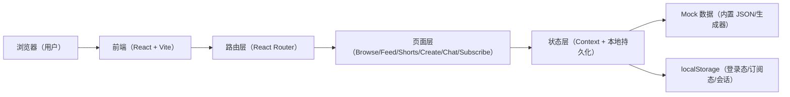

## 1. 架构设计



## 2. 技术说明
- 前端：React@18 + Vite + JavaScript
- 路由：react-router-dom（用于“导航不变但 URL 改变，右侧内容切换”的体验）
- 状态管理：React Context + hooks（必要处）+ localStorage 持久化
- 样式：优先使用 CSS Modules / 组件级样式（不强依赖额外 UI 框架）
- 数据：全量 Mock（人物、短剧、会话、订阅套餐、banner），不接后端

## 3. 路由定义
| 路由 | 用途 |
|---|---|
| / | 重定向到 /browse |
| /browse | 首页内容：顶部工具区 + banner + 快捷入口 + 人物列表 |
| /feed | 浏览刷视频流（类似抖音） |
| /shorts | 短剧列表 |
| /shorts/:id | 短剧播放/详情面板 |
| /create | 创造人物向导 |
| /chat | 会话列表 + 默认欢迎面板 |
| /chat/:id | 与指定人物的对话页 |
| /subscribe | 套餐订阅页 |
| /subscription | 订阅管理页 |

## 4. 数据模型（前端 Mock）

### 4.1 核心实体（Type Shape）
```js
// UserSession
{
  isLoggedIn: boolean,
  displayName: string,
  avatarUrl: string,
  language: "zh-CN" | "zh-Hant" | "en-US"
}

// Character
{
  id: string,
  name: string,
  avatarUrl: string,
  tags: string[],
  bio: string,
  stats: { heat: number, online: boolean },
  starter: string
}

// Conversation
{
  id: string,
  characterId: string,
  updatedAt: number,
  messages: Array<{ id: string, role: "user" | "assistant", text: string, createdAt: number }>
}

// Subscription
{
  planId: string | null,
  status: "none" | "active" | "canceled",
  renew: boolean,
  expiresAt: number | null
}

// Banner
{
  id: string,
  title: string,
  subtitle: string,
  ctaText: string,
  href: string
}

// ShortDrama
{
  id: string,
  title: string,
  coverUrl: string,
  episodes: number,
  description: string
}
```

### 4.2 持久化策略（localStorage）
- userSession：登录态、语言选择
- subscription：当前订阅状态、到期时间、自动续费开关
- conversations：会话列表与消息（用于“真实原型”的连续体验）
- createdCharacters：用户创建的人物（创建页完成后可在列表中出现）

## 5. 关键交互的实现要点（无后端）
- 登录/注册弹窗：前端校验（必填/格式）+ 模拟请求延迟 + 成功后写入 userSession
- 订阅：选择套餐后弹出确认，模拟支付成功；写入 subscription 并在管理页展示
- 语言切换：文案字典（i18n 简化实现）覆盖导航/按钮/提示；切换立即生效并持久化
- 路由体验：侧边栏不变，右侧为 <Outlet>；URL 改变但布局稳定
